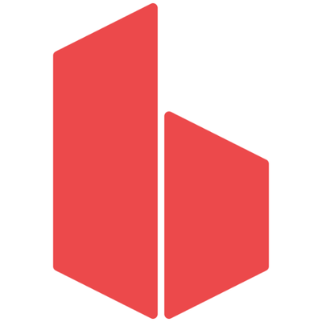

# Bootstrap-Theme

Hay dos formas de manejar boostrap.
Linkear los archivos o tenerlos instalados localmente.

Descargamos utilizando node.js
Node es basicamente na manera de ejecutar javascript fuera del navegador.

Webpack administra los archivos que tengo en el frontend (js, sass, etc) y los transforma a produccion.

Se puede usar con boostrap pero se puede usar algo mas sencillo:
GULP:

Gulp es una manera de poder ejecutar uns serie de comandos que nos permite poder configurar tareas
Por ejemplo le podemos decir a node.js que copie todos los archivos html a una nueva carpeta
U otra tarea podria ser que minifique todos los archivos css para que pesen menos
O que todos los archivos javascript les redusca el tamano
O que todos los archivos sass los convierta
De eso va gulp, poder escribir tareas automatizadas.

Tambien vamos a utilizar Browser sync,

que es para poder tener una sevidor en tiempo real, para que la pagina de refresque sola.

Lo primero ejecutamos npm init --y
Esto crea un package.json, que tiene el nombre, la version, el repositorio, etc.
Por ahora es solo un archivo que describe de que va nuestro proyecto.

Vamos a ir instalando las dependencias que voy a necesitar:
La primera y pricipal: bootstrap:
npm i bootstrap

Tambien istalamos font-awesome para los iconos
npm i font-awesome

tambien jquery y popper
npm i jquery popper.js
Juans-MacBook-Air:Bootstrap-Theme juansebastianmacchia$ npm install jquery popper.js
+ jquery@3.3.1
+ popper.js@1.14.3

si ahora vemos el archivo package.json ahora tiene las dependencias:

  "dependencies": {
    "bootstrap": "^4.1.3",
    "font-awesome": "^4.7.0",
    "jquery": "^3.3.1",
    "popper.js": "^1.14.3"
  }

  

